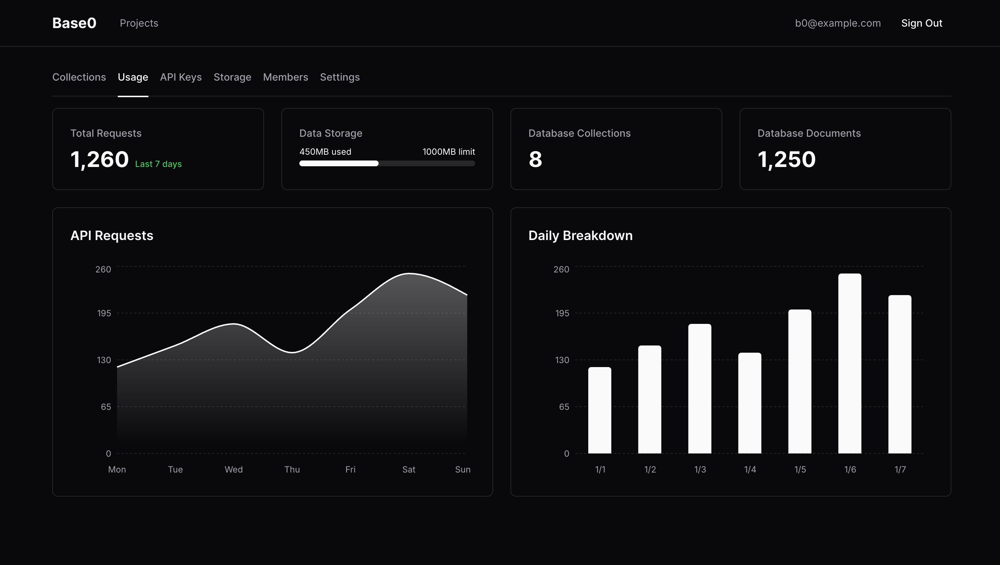

<p align="center">
  
</p>

<p align="center">
  A minimal backend platform
</p>

<p align="center">
  <a href="LICENSE">
    
  </a>
  
  
  
  
</p>

<hr />

## Overview

A lightweight backend platform providing authentication, document storage, file handling, and RBAC through a type-safe API and React-based control plane.

<p align="center">
  
</p>

## Architecture

The platform is engineered as a monorepo leveraging Bun and Turborepo. It prioritizes:
- **Edge-native compatibility**: Designed to run efficiently on modern runtimes.
- **Type Safety**: End-to-end typing shared between client and server.
- **Minimalism**: Leveraging standard Web APIs (Request/Response) over heavy framework abstractions.

## Core Features

### Authentication
- JWT-based session management with automatic access and refresh token rotation.
- Secure, industry-standard password hashing using Argon2id.
- Passwordless authentication flows using Magic Links.
- Extensible OAuth2 interface supporting providers like GitHub and Google.

### Data Engine
- Dynamic schema definitions utilizing runtime Zod validation.
- Strict multi-tenant isolation via logical project separation.
- Advanced querying capabilities leveraging PostgreSQL JSONB.

### Blob Storage
- Pluggable driver architecture supporting Local filesystem and S3-compatible providers (AWS, MinIO, R2).
- Secure, presigned upload mechanisms and streaming downloads.
- Integrated file metadata tracking and management.

### Access Control
- Granular Role-Based Access Control (RBAC) with Owner, Admin, Member, and Viewer roles.
- Project-scoped API keys with precise permission enforcement.
- Native rate limiting to prevent abuse.

## Getting Started

### Prerequisites

- **Bun**: v1.2 or higher
- **Docker**: Required for local PostgreSQL instance

### Installation

1.  **Clone the repository**
    ```bash
    git clone https://github.com/itisrohit/base0.git
    cd base0
    ```

2.  **Install dependencies**
    ```bash
    bun install
    ```

3.  **Configure environment**
    ```bash
    cp .env.example .env
    ```

4.  **Initialize infrastructure**
    Start the database container and apply schema migrations:
    ```bash
    docker-compose up -d db
    bun run db:push
    ```

### Development

To start the API and Dashboard simultaneously in development mode:

```bash
bun run dev
```

- **API Server**: http://localhost:3001
- **Dashboard**: http://localhost:3000

## REST API

Base0 is a pure REST API — no SDK required. Use any HTTP client (`curl`, `fetch`, `axios`) to interact with it.

### API Key (Programmatic Access)

This is the primary way to use Base0 from your apps. Create an API key in the Dashboard (or via JWT), then use it directly:

```bash
KEY="b0_<keyId>_<secret>"
PROJ="proj_..."

# Create a collection
curl -X POST http://localhost:3001/v1/projects/$PROJ/collections \
  -H "X-API-Key: $KEY" \
  -H "Content-Type: application/json" \
  -d '{"name":"tasks","schemaDef":{"fields":[{"name":"title","type":"string","required":true}]}}'

# Insert a document
curl -X POST http://localhost:3001/v1/projects/$PROJ/collections/<COL_ID>/documents \
  -H "X-API-Key: $KEY" \
  -H "Content-Type: application/json" \
  -d '{"data":{"title":"Hello"}}'

# Query with filters
curl "http://localhost:3001/v1/projects/$PROJ/collections/<COL_ID>/documents?title[contains]=Hello&sort=createdAt" \
  -H "X-API-Key: $KEY"
```

The API key is scoped to a specific project. With it you can manage collections, documents, storage, members, and read usage telemetry. **[Full API reference →](docs/api.md)**

### JWT (User Sessions)

Use for auth flows and project management (signup, login, create/delete projects, manage API keys):

```bash
# Sign up
curl -X POST http://localhost:3001/v1/auth/signup \
  -H "Content-Type: application/json" \
  -d '{"email":"user@example.com","password":"password123"}'

# Use the returned token
curl -H "Authorization: Bearer <token>" http://localhost:3001/v1/projects
```

## Contributing

Please review [CONTRIBUTING.md](CONTRIBUTING.md) for details on our code of conduct and the process for submitting pull requests.

## License

This project is licensed under the [MIT License](./LICENSE).
